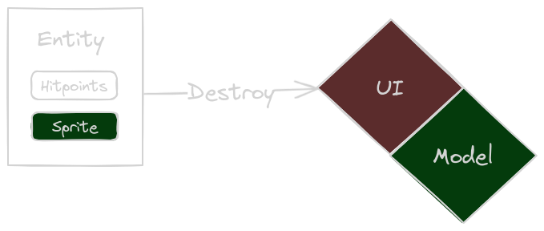
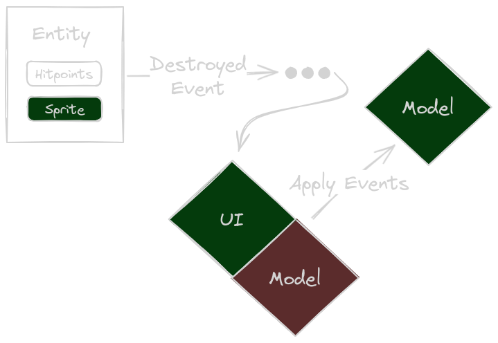
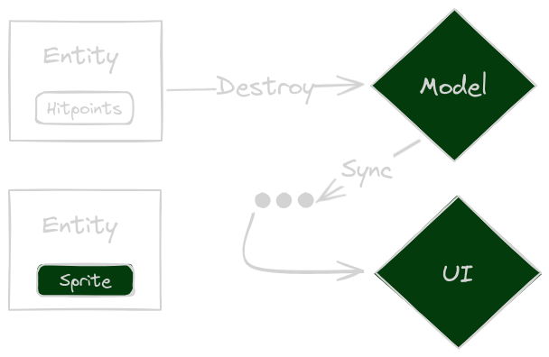

+++
title = "Remnants of the Vanquished"
date = 2023-12-19
[taxonomies]
tags = ["gamedev"]
+++

Now, let me reveal the name of the [Unnamed Game](). This time, we will focus on some more technical aspects of the game. As a disclaimer: I use Bevy, which more or less enforces the use of an Entity Component System (ECS). ECS is kind of a hype (micro-services anyone?), of course it can be used for everything - but does it fit everything? Still, I am not yet turning my back on Bevy just yet, so I'll have to make do.

## Short Recap
[Last time]() I was babbling about model and visual components. I laid out some rules I "found" for turn based games using ECS:
* Only core game logic systems may modify game logic components.
* Only core game logic systems may remove game logic entities. They should send events in that case.
* Non core game logic systems may add and modify their components to game logic entities. They must also ensure to clean up after themselves by removing components when systems go out of scope.
* Non core game logic systems must handle entities suddenly disappearing and appearing.

Alas, while I still think those are valid - a more restrictive approach might be necessary. Let's take a step back and re-evaluate the current design approach.

# Different Representation of What the Player Sees and What the Game "Thinks"
I mentioned [before](), that its harder for turn-based game to work with entities. ECS' are designed to run continuously, so for "discrete" components (discrete in time) - the result is stuttering.

But what does that mean? Let's dive into the problem, by looking at several approaches on how to model game entities. For the sake of understandability, we'll limit ourselves to one discrete event: A ship getting destroyed. 

## Visual Components and Model Components Share Entity
In this scenario, what the game "thinks" and what the player sees are the same. For the most part. Sounds simple enough. But, it has some repercussions. 

### Immediate Model Updates: A No-Go

To the left is a representative entity. It contains hit points as a model component and a sprite as a visual component. The entity is in the process of being destroyed. To the right is the game state, separated by UI (visuals) and Model (what the game thinks). The UI is red, because the entity suddenly disappears which is inconsistent with what the player expects to happen (things going boooom). But the model is consistent (in a more computer sciency term - all invariants are held).

**Conclusion**: This is essentially a bad option, the game is for the player - not for the CPU or my peace of mind.

### Delayed Model Updates: So-So

A similar representation as before, but this time the entity is not destroyed immediately. Instead, the "planned" destruction is communicated by an event or a flag in some component.

The UI has plenty of time to show explosions and whatnot. But, as indicated by the red model state, there's a period where the model's invariants don't hold: a "dead" ship shouldn't be present anymore. They will have to be removed later, by game model systems mind you, if the non-game-logic systems start meddling around things will get messy).

This will obviously work, but is a bit "ugly" from a technical point of view. The game logic systems will have to "mark" things other game logic systems will "later" do. In-between the game model is in a meh state. If, for example, the player was to leave the game (saving it in the process), loading it later would start by playing some animation - or not. It depends on whether the UI systems recreate the UI components for the already "marked as dead" ship.

**Conclusion**: This approach works but carry the stench of potential problems when restoring the game state.

## Separate Entities: Good, but More Effort

With this design, there are no "reds". There is an entity for the model and an entity for the UI. The UI will try to keep entities in sync. If an entity in the model is destroyed, the UI can keep its entity around and start the destruction animation. 

The model's invariants are held, and the player won't be confused. But we pay a price, we need to sync the relevant data. However, it offers the choice to diverge more freely from ECS in the model. The core game model does not need to be based on ECS at all.

**Conclusion**: This will work, but will also be more effort to implement.

## Summary
As always, there is no single best solution - all have draw-backs. Coming from a business development perspective, it often pays to separate domain models:

"Sourcing" is the term for where data is coming from. Basically, that is, what I will be doing. That means "Separate Entities" is the way to go from here.

It also means I do not have to use ECS for the core game. Which means I can use a separate package (crate in Rust terms). That means Bevy will "just" be the frontend - which I could replace without touching the game rules at all.

# Conclusion
Having designed and implemented multiple smaller games using ECS, there is a challenge in using it for turn-based games. Using a separate `World` and schedule is something that can be used to make it work. But the gains are small in my opinion. As shown above I faced basic problems with my approach. I want to avoid wasting time later on, trying to synchronize all the data for entities that are a mixed bag of real-time components and turn-based components.

Thanks for sticking around, maybe you learned something - I sure did. See you next time...
