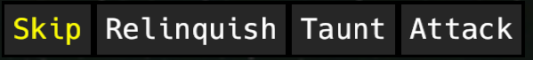

+++
title = "The Yet to be Named Game"
date = 2023-11-16
[taxonomies]
tags = ["gamedev"]
+++

[Previously]() we took a birds eye view on the topic of the game development process.
Or, to be more precise, the model in my mind. I plan on refining and correcting it as I go and learn.

## Current State of My Game
I can actually show a screenshot of my prototype:

It contains a background I made and some ships an AI model created (for the prototype only, I will create or commission the real art). To the left are the player ships, to the right the enemy ships (I did not even bother to make the "look" toward the player ships).

### Game of Stacks
What is shown above contains the basic idea of the game: 
* You and the enemy have a stack of ships. 
* Either "player" can only perform actions with the ship on top
* Actions generally evolve around stack manipulation
* Actions doing damage will do so only to the top enemy ship for the most part
I intend to not change these, if possible. 

Things that are not set in stone, but shown above:
* The action the enemy ship "would" take if it was on top. The reason it shows up for all enemies is that a player action could move an enemy to the top.
* Health *and* shield. Not only does it work for a sci-fi setting, it adds a tactical layer - shields will be replenished at the start of combat.

Here are the current actions of the top ship (it is taking the role of a "tank" in classical RPG terms):

Lets take a look at the actions (keep in mind this is a very early prototype and things can and will change here):
* **Skip**: all ships can do this, reasons for using it: Ship is on cooldown, all relevant actions are on cooldown, or the player wants to avoid cooldown. It will just move the ship to the bottom of the stack, ending the players turn.
* **Relinquish**: The ship will move down one spot in the stack, the new top ship will immediately be ready for action. This allows the player to perform an action of another ship. This will mostly move the original ship back up on the top, which will take the response (its the tank after all).
* **Taunt**: The enemy ship will take some small damage and the current ship will not be moved away. This allows the player to letting the current ship take a hit that would otherwise target the next player ship.
* **Attack**: A light attack, after which the ship will move to the bottom of the stack. This is one of the simpler damage dealing actions, with a predictable stack positioning.

As you might have guessed, predicting the position of enemy and player ships is required to make effective use of the players fleet. In my last post I commented on the inspiration for the game. Funnily enough, its main source is [Into the Breach](https://store.steampowered.com/app/590380/Into_the_Breach/) and not [Slay the Spire](https://store.steampowered.com/app/646570/Slay_the_Spire/). But it differs a lot: 
* The obvious difference is, its not played on a grid. 
* And the player doesn't get to freely move around ships in the stack. 
* Its also hard to avoid taking damage.

Some of these limit the choice a player has each turn. One thing I try to compensate that is the addition of shields. The amount of health and shields is still very low, I want to make each turn as decisive as possible. It wouldn't work if players and enemies would have at it for hours.

### Challenges
Besides using [bevy](https://bevyengine.org/), which might be a questionable decision - creating a turn based game in real-time engine poses some challenges.
Since systems run all the time, they need to "not do anything" as long as neither the player, nor the AI makes moves. There's also the problem that AI actions should be delayed - or appear delayed to avoid confusing the player.

But the harder challenge was and is making the core mechanics "fun". I am a firm believer of "less is more" - so I am trying to add as little as possible at a time to test if I can improve the prototype. It kind of boils down towards the target audience, which in turn is also determined by the number of choices a player has at each "turn" when "playing" something:

Obviously this plot has no indication of "fun" in it. There's always a "player" having fun at any point. Depending on the person, almost everything on that plot might "fit" at some point.

*Why did I show it?*
All human interaction can be placed somewhere on there. To the left your influence is miniscule (only few people can influence book authors). To the right your choice is abundant. Think hiking. For games it has additional consequences: To the left you will basically make an interactive movie. That means extremely high production value or an artistic product. To the right its also very high production value. Or so flexible it's almost a content creation tool. [Factorio](https://www.factorio.com/), [Minecraft](https://www.minecraft.net/), ...

I want my game to be in the middle. Enough choice to make every decision count. Not so extremely limited that the game is pretty much deterministic. Games tend to look simpler there, but the mechanics are polished to death. It will be tough and I expect the game to suck, but me a huge learning experience.

### Short-Term Goals
Tweaking the core mechanics. Implementing the "paths" a player can take. Adding environmental effects, like a solar flares of a local star damaging shields of all ships. Adding energy that can be used to upgrade ships. And repair cores to heal ships after combat.

And in-between that: Testing testing testing, finding people who will play-test such an early prototype.

### Long-Term Vision
I do have a nice narrative, and hope to add it in the game without boring players. I also would like to add side-quests, that can force players to take certain paths but will give rewards. For example, taking a friendly ship along and bring it to some destination.

### Outlook
I hope to have the core mechanics basics done in time for the next update. I also want to do some reviews of similar games I played to get inspiration. The reviews will be focussed on the core mechanics mostly. I'll start with [Star Renegades](https://store.steampowered.com/app/651670/Star_Renegades/).

Feel free to suggest topics you want me to dive into. I'll do so even when I have no clue what I am talking about, I'll just fake it. Seems to work well enough.
