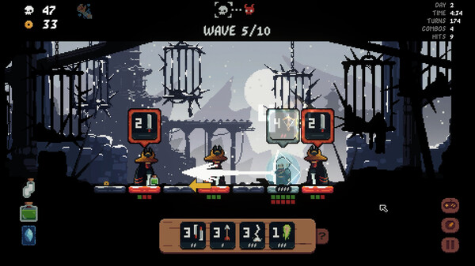

+++
title = "Shogun Showdown Core Mechanics"
date = 2023-12-06
[taxonomies]
tags = ["gamedev"]
+++

[As promised](@unnamed-game/index.md), in this post, we will take a look at the game [Shogun Showdown](https://store.steampowered.com/app/2084000/Shogun_Showdown/). It is still in early access, but has very good review scores and a sizeable amount too.
Its Steam page tells it's "inspired by great games like Into the Breach, Darkest Dungeon, Crypt of the Necrodancer, Slay the Spire and so much more". That is similar to the inspirations behind my own game. As my in-development game shares some of these traits, this game certainly is one I need to take a closer look.

# A Quick Detour: My Game
I'm on a [journey](@unamed-game/index.md) to create and publish a game. The plan is to create a rogue-like with turn based combat, as mentioned just above. To not fumble blindly in game design, I want to check out and review similar games. But, mostly from a mechanics perspective. So let's get back to Shogun Showdown...

# What is the Game?
It's a turn-based, rogue-like battler set in a Japanese-inspired setting. It features nice pixel art and a good soundtrack. I have not yet beaten the game, but from my current knowledge it basically has a few scenes:
* a Shop scene
* a Combat scene
* an Upgrade-only scene

And while there are some random elements, the combat is pretty much deterministic. Since players will spent most of their time in that scene, let's dive deeper:

# The Combat Scene
Let's start with a look on a typical combat scene:

As mentioned, there's not much randomness going on. The player has a set of actions, they can perform. Most will "end the turn" for the player and the enemies get to act. The game, like mine, tries to take elements from [Into the Breach](https://store.steampowered.com/app/590380/Into_the_Breach/). Reduced to 1 dimension, they left out units to protect. Its feasible to add those, so they might show up in a future update. The game also uses different "field" sizes, depending on the scenario.

Also, like in my imagined game, there are no decks. You get actions, and that's all you get (mostly). Besides movement, the actions are similar to cards in other games. You can upgrade them, "drawing" is emulated by cool-downs. A very clever idea is the stacking of actions. It allows delaying attacks, unleashing multiple attacks in quick succession, damaging multiple enemies. It's neatly embedded, and required to defeat certain game stages.

Another nice mechanic is the movement of the player and enemies. That includes actions that the player and enemies can use to move multiple tiles. It requires careful planning to avoid taking damage when moving to close to an enemy.

Enemies behave pretty deterministic and their chosen actions and action executions are at all times visible to the player. As with Into the Breach, this adds a nice puzzle-like feeling to the game: "How can I solve this without taking any or much damage?"

Sometimes (at least for me) it backfires a bit. Some enemies can attack from afar. If you focussed on close combat your only option is to try to get another enemy in-between. It feels a bit like "iterative deepening": You make a bit of progress in the game, suddenly an enemy shows up that thwarts your choices. Maybe it's still possible to win, and it's just my skill (or lack thereof). I did not get that feeling in Into the Breach, it always seemed fair. Alas, it was not in early access, so I'll cut Shogun Showdown some slack.

## Summarized
Movement and attack ranges give of a nice "chess"-like feeling. Enemies with no line-of-sight generally will just idle. But the "initiative" (i.e. the order in which units are taking turns) of the enemy is hidden. So, when you manage to get enemies to attack each other (which is a really nice mechanic), you don't know which one will attack first.

The game is pretty forgiving, for a rogue-like. Health flasks and other consumables help, when a bad choice makes for a dire situation. 

## Compared to My Game Idea
### Stacks vs Board
The stacks in my prototype are similar to the one dimensional "board" in this game. This choice naturally leads to a reduced set of actions. The player can not attack any random enemy, but will have to select one of a few viable targets. Same for the enemies, many just can't target the player due to other units being in the way. Its more natural than the stacks in my prototype, which allow targeting the top ship only, most of the time.

### Damage Management
{{ fit_img(path="damage-management.png", alt="A real artist") }}
Another thing is the damage management. Its basically the core of Into the Breach, and also of Shogun Showdown. My prototype does things differently. You can almost never avoid taking damage. Instead, something that fits the lore of a science fiction game, I added shields. Shields get replenished fully at the start of each combat. Since damage cannot be avoided, the goal is to distribute the damage across all player ships to avoid actual hull damage.

### Movement
{{ fit_img(path="movement.png", alt="Shake it") }}
There is no actual movement per se in my game idea. Actions will usually put a ship to the bottom of the stack. Some can actions allow changing the player stack. Some modify the enemy stack. This differs a lot from Into the Breach and Shogun Showdown. In both games the player can actively move unit(s). For Shogun Showdown, this means an actual turn. For Into the Breach, the player still can perform an action. Not diving into this too much for now, it essentially means I might need to re-design movement in my game.

# The Other Scenes
There are shopping, upgrade and path selection scenes. The least important seems to be the path selection one. It has not struck me as very important on what benefits selecting different paths might have. I guess one could just remove it and tell a linear tale, for now.

Upgrading seems kinda important, but most of the time its "you gain some you lose some". Even upgrades that cost "money" are sometimes not game-changers. I should play a bit more (almost certainly not because its a fun game) to check this further.

Shopping... I mean, it allows adding more tiles and has actions and such. But it feels a bit superfluous. I'm also pretty sure the sense of "puzzle combat" will be gone once I have a lot of actions available. Into the Breach managed to get superb gameplay by having about 6-8 actions (besides moving around) in a whole session.

# Verdict
Its a fun game. Combat feels nice for the most part and when I am surprised, its mostly through my own lack of planning. There's no observable narrative, the setting is very cool - the game really needs one. The world map serves no other purpose than to click a random next location. Upgrading and shopping seems a bit superfluous. BUT - this is an Early Access game. The actual combat is so much fun, I am pretty sure the devs can improve the other aspects. It could stand right there, next to Into the Breach - with some work.

For my journey, it shows some the flaws in my game design I need to address. Its such a wonderful time in which I can validate ideas also by looking at what other people did. Not that this approach did not work many years ago, but the amount of good quality (and bad quality) games is huge. Thanks for reading - next time I will write about my prototype again. Stay tuned.
